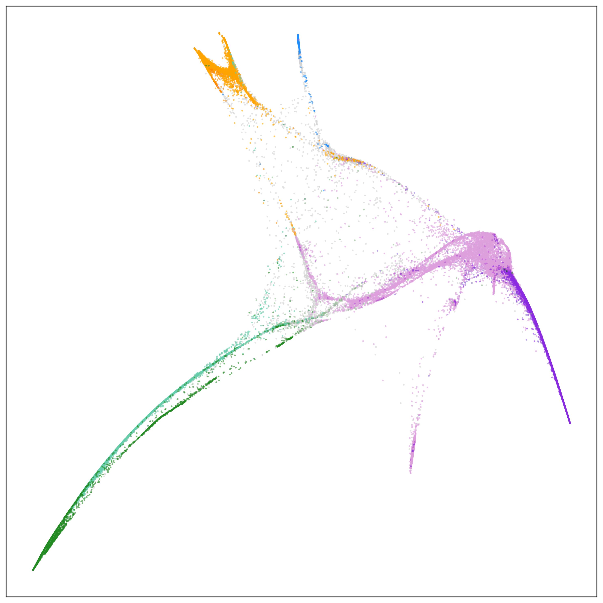
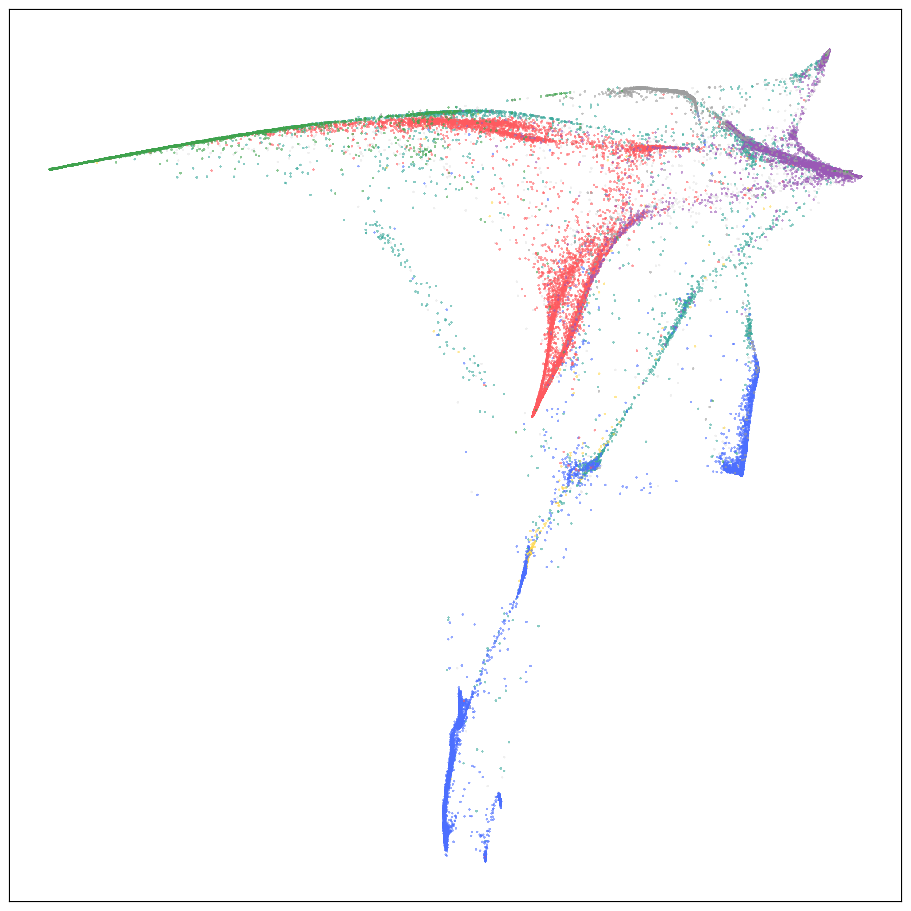

# manifold-genetics

A lightweight, batteries-included Python package for genetic analysis with dimensionality reduction and visualization.

<p align="center">
  
  
</p>

## Features

- **PCA**: FlashPCA wrapper for fast principal component analysis
- **Admixture**: Neural admixture analysis
- **Embeddings**: PHATE, UMAP, t-SNE, and Diffusion Maps for manifold learning
- **Visualization**: Publication-ready plots with customizable colormaps
- **Metrics**: Geographic and admixture preservation metrics
- **Pipeline**: End-to-end orchestration from PLINK files to visualizations
- **Auto-downloads tools**: Automatically downloads plink2 and flashPCA on first use

## Quick Start

### Step 1: Installation

#### Installing uv

First, install `uv` (a fast Python package installer and resolver):

```bash
curl -LsSf https://astral.sh/uv/install.sh | sh
```

#### Setting up the Python environment

Clone the repository and create the Python environment (we recommend Python 3.11):

```bash
git clone https://github.com/MattScicluna/manifold_genetics
cd manifold_genetics

# Create virtual environment with Python 3.11 (recommended)
uv venv --python python3.11

# Install dependencies
uv sync --frozen

# For contributors (includes dev tools like pytest, black, etc.)
uv sync --frozen --extra dev
```

#### External tools

The package requires external command-line tools (plink2, flashpca, and plink v1.9) that are not Python packages.

Run the setup command to download these tools (requires internet access):

```bash
uv run manifold-genetics setup
```

This command does NOT manage the Python environment. It only downloads external binaries to the `bin/` directory.

This will download:
- **plink2** to `bin/plink2` (~20MB)
- **flashpca** to `bin/flashpca` (~2MB)
- **plink v1.9** to `bin/plink` (~2MB)

### Step 2: Verify Installation (Optional but Recommended)

Run the test suite to confirm everything is working:

```bash
# Install dev dependencies (includes pytest)
uv sync --frozen --extra dev

# Run tests
uv run pytest -m "not slow and not network"
```

Expected: **55 tests passing** in ~150 seconds. See [Testing](#testing) section for details.

### Step 3: Run HGDP+1KGP Example

The package includes a complete working example using HGDP+1000 Genomes Project data.

#### Download and prepare data (first time only):

```bash
cd /path/to/manifold_genetics

# Download data (~200MB, requires internet)
bash examples/hgdp_1kgp/download_data.sh

# Prepare data for analysis
bash examples/hgdp_1kgp/prepare_data.sh
```

#### Run the full pipeline:

```bash
# From repository root
bash examples/hgdp_1kgp/run_pipeline.sh
```

**Runtime:** ~A couple of hours on CPU (faster with GPU for admixture)

**Outputs** saved to `examples/hgdp_1kgp/outputs/`:
- `pca/` - PCA coordinates (fit: 3,400 samples, project: 4,094 samples)
- `admixture/` - Ancestry proportions for K=2 to 10
- `embeddings/` - PHATE 2D embedding (4,094 samples)
- `figures/` - All visualization plots
- `metrics/` - Geographic and admixture preservation metrics

#### About the Example Data

- **Fit subset:** 3,400 unrelated samples (for model training)
- **Project subset:** 4,094 QC-passing samples (for model application)
- **172,152 SNPs** (LD-pruned, MAF ≥0.01)
- **7 genetic regions:** Africa, Americas, Central/South Asia, East Asia, Europe, Middle East, Oceania

## Command-Line Interface

The CLI provides a built-in help system. Run `manifold-genetics --help` for the full command list,
or `manifold-genetics <subcommand> --help` (or `manifold-genetics <subcommand> -h`) for subcommand-specific usage and
option descriptions.

### Pipeline (recommended)

Run from the repository root. Outputs land under `examples/hgdp_1kgp/outputs/` in subfolders (`pca/`, `admixture/`, `embeddings/`, `figures/`), and metrics are computed from the pipeline run.

```bash
uv run manifold-genetics pipeline \
    --fit-plink examples/hgdp_1kgp/data/fit_subset \
    --project-plink examples/hgdp_1kgp/data/project_subset \
    --labels examples/hgdp_1kgp/data/hgdp_project_labels.csv \
    --colormap examples/colormaps/hgdp_1kgp.json \
    --output examples/hgdp_1kgp/outputs \
    --n-pcs 50 \
    --k-min 2 --k-max 5 \
    --embedding phate --knn 100 --t 3 \
    --embedding-input project \
    --threads 8
# Optional: --num-gpus 1
# Optional: --geographic examples/hgdp_1kgp/data/hgdp_project_geographic.csv
```

Skip steps as needed:
```bash
uv run manifold-genetics pipeline ... --skip-pca --skip-admixture --skip-metrics
```

### Equivalent Individual Commands (same outputs as pipeline)

Run from repo root; paths below match the pipeline output layout.

```bash
# 1) PCA: fit on fit_subset, project on project_subset
uv run manifold-genetics pca \
    --fit-plink examples/hgdp_1kgp/data/fit_subset \
    --project-plink examples/hgdp_1kgp/data/project_subset \
    --fit-output examples/hgdp_1kgp/outputs/pca/fit_pca_50.csv \
    --project-output examples/hgdp_1kgp/outputs/pca/transform_pca_50.csv \
    --flashpca-output-dir examples/hgdp_1kgp/outputs/pca/flashpca_outputs \
    --n-pcs 50

# 2) Admixture: fit on fit_subset, project on project_subset
uv run manifold-genetics admixture \
    --fit-plink examples/hgdp_1kgp/data/fit_subset \
    --project-plink examples/hgdp_1kgp/data/project_subset \
    --neuraladmixture-output-dir examples/hgdp_1kgp/outputs/admixture/checkpoints \
    --fit-output examples/hgdp_1kgp/outputs/admixture/fit \
    --project-output examples/hgdp_1kgp/outputs/admixture/transform \
    --k-min 2 --k-max 5 --threads 8
# Outputs (per K): examples/hgdp_1kgp/outputs/admixture/fit.{K}.csv and transform.{K}.csv

# 3) Embedding (PHATE): fit and transform on projected (transform) PCA coordinates
uv run manifold-genetics embed \
    --method phate \
    --fit-input examples/hgdp_1kgp/outputs/pca/transform_pca_50.csv \
    --project-output examples/hgdp_1kgp/outputs/embeddings/phate_2d.csv \
    --knn 100 --t 3

# 4) Visualization

# PCA
uv run manifold-genetics plot-pca \
    --input examples/hgdp_1kgp/outputs/pca/transform_pca_50.csv \
    --labels examples/hgdp_1kgp/data/hgdp_project_labels.csv \
    --colormap examples/colormaps/hgdp_1kgp.json \
    --output examples/hgdp_1kgp/outputs/figures/pca \
    --n-pcs 50

# PHATE
uv run manifold-genetics plot \
    --input examples/hgdp_1kgp/outputs/embeddings/phate_2d.csv \
    --labels examples/hgdp_1kgp/data/hgdp_project_labels.csv \
    --colormap examples/colormaps/hgdp_1kgp.json \
    --output examples/hgdp_1kgp/outputs/figures/embeddings/phate.png

# Admixture barplots (stacked bars per K)
# Use --component-colors-output to save the component colour assignments to JSON.
# This lets plot-admixture-embedding use the same colours as the bar chart.
uv run manifold-genetics plot-admixture \
    --q-prefix examples/hgdp_1kgp/outputs/admixture/transform \
    --labels examples/hgdp_1kgp/data/hgdp_project_labels.csv \
    --group-column Genetic_region_merged \
    --colormap examples/colormaps/hgdp_1kgp.json \
    --k-min 2 --k-max 5 \
    --output examples/hgdp_1kgp/outputs/figures/admixture/transform_bars.png \
    --component-colors-output examples/hgdp_1kgp/outputs/admixture/component_colors.json

# Admixture embedding grid — coloured by admixture component proportion.
# Pass --component-colormap (exported by plot-admixture above) so each component
# subplot uses a white-to-component-colour gradient that matches the bar chart.
uv run manifold-genetics plot-admixture-embedding \
    --embedding examples/hgdp_1kgp/outputs/embeddings/phate_2d.csv \
    --q-prefix examples/hgdp_1kgp/outputs/admixture/transform \
    --k-min 2 --k-max 5 \
    --output examples/hgdp_1kgp/outputs/figures/admixture/transform_embedding.png \
    --component-colormap examples/hgdp_1kgp/outputs/admixture/component_colors.json

# 5) Overlay reference (fit) and target (project) embeddings (cross-cohort comparison)
uv run manifold-genetics plot-projection \
    --fit-embedding examples/hgdp_1kgp/outputs/embeddings/phate_fit_2d.csv \
    --project-embedding examples/hgdp_1kgp/outputs/embeddings/phate_project_2d.csv \
    --fit-labels examples/hgdp_1kgp/data/hgdp_fit_labels.csv \
    --project-labels examples/hgdp_1kgp/data/hgdp_project_labels.csv \
    --fit-colormap examples/colormaps/hgdp_fit.json \
    --project-colormap examples/colormaps/hgdp_project.json \
    --fit-column Genetic_region_merged \
    --project-column Genetic_region_merged \
    --output examples/hgdp_1kgp/outputs/figures/embeddings/projection.png

# 6) KNN label composition (how well reference labels characterise project individuals)
uv run manifold-genetics plot-knn-composition \
    --fit-embedding examples/hgdp_1kgp/outputs/embeddings/phate_fit_2d.csv \
    --project-embedding examples/hgdp_1kgp/outputs/embeddings/phate_project_2d.csv \
    --fit-labels examples/hgdp_1kgp/data/hgdp_fit_labels.csv \
    --fit-label-column Population \
    --project-labels examples/hgdp_1kgp/data/hgdp_project_labels.csv \
    --project-label-column Genetic_region_merged \
    --fit-colormap examples/colormaps/hgdp_fit.json \
    --k 10 \
    --output examples/hgdp_1kgp/outputs/figures/embeddings/knn_composition.png

# 7) Metrics (optional, standalone)
uv run manifold-genetics metrics-geographic \
    --embedding examples/hgdp_1kgp/outputs/embeddings/phate_2d.csv \
    --geographic examples/hgdp_1kgp/data/hgdp_project_geographic.csv \
    --output examples/hgdp_1kgp/outputs/metrics/geographic.json \
    --num-dists-sampled 50000

uv run manifold-genetics metrics-admixture \
    --embedding examples/hgdp_1kgp/outputs/embeddings/phate_2d.csv \
    --admixture-output examples/hgdp_1kgp/outputs/admixture/transform \
    --output examples/hgdp_1kgp/outputs/metrics/admixture.json \
    --k-min 2 --k-max 5 \
    --num-dists-sampled 50000
    # --subsample 5000  # recommended for large biobanks (AoU, UKBB); not needed here (~4K samples)
```

## Data Formats

### Input Files

**PLINK files** (`.bed`, `.bim`, `.fam`) - Binary genotype data:
```bash
--fit-plink data/fit_subset          # Training/reference set
--project-plink data/project_subset  # Projection/application set
```
Specify the prefix only (tool appends `.bed/.bim/.fam` automatically).

**Labels CSV** - Sample metadata with `sample_id` column:
```csv
sample_id,Population,Genetic_region
HGDP00001,Yoruba,Africa
HGDP00002,Yoruba,Africa
HGDP00003,Han,EastAsia
```

**Colormap JSON** - Maps label values to hex colors:
```json
{
  "Population": {
    "Yoruba": "#FF0000",
    "Han": "#00FF00"
  },
  "Genetic_region": {
    "Africa": "#FF6B6B",
    "EastAsia": "#4ECDC4"
  }
}
```

**Geographic coordinates CSV** (optional, for metrics) - Sample locations:
```csv
sample_id,latitude,longitude
HGDP00001,6.5244,3.3792
HGDP00002,39.9042,116.4074
```
Required columns: `sample_id`, `latitude`, `longitude`. Used with `--geographic` flag for geographic preservation metrics.

### Output Files

**PCA** (`fit_pca_N.csv`, `transform_pca_N.csv`) - Principal component coordinates:
```csv
sample_id,dim_1,dim_2,...,dim_N
HGDP00001,0.073308,0.212584,-0.012974,...
HGDP00002,0.073231,0.210938,-0.012130,...
```
Where N = `--n-pcs` (default 50). Each row is a sample, columns are PC coordinates.

**Admixture** (`fit.K.csv`, `transform.K.csv`) - Ancestry proportions:
```csv
sample_id,component_1,component_2,...,component_K
HGDP00001,0.9996,0.0004
HGDP00002,0.9996,0.0004
```
Where K = number of ancestral populations (from `--k-min` to `--k-max`). Components sum to 1.0 per sample.

**Embeddings** (e.g., `phate_2d.csv`) - Low-dimensional manifold coordinates:
```csv
sample_id,dim_1,dim_2
HGDP00001,0.123,-0.456
HGDP00002,0.234,-0.567
```
Typically 2D for visualization (controlled by `--n-components`).

## Running on Your Own Data

### Quick Start (3 Steps)

1. **Prepare your files:**
   - PLINK files (`.bed/.bim/.fam`) - binary genotype data
   - Labels CSV - sample metadata with `sample_id` column
   - Colormap JSON - hex colors for each column label from labels CSV file. NOTE: ordering of labels is plotting order for subsequent plots.

2. **Run the pipeline:**
   ```bash
   uv run manifold-genetics pipeline \
       --fit-plink data/your_data \
       --project-plink data/your_data \
       --labels data/labels.csv \
       --colormap data/colormap.json \
       --output results/
   ```

**That's it!** Results (PCA, admixture, embeddings, figures, metrics) saved to `results/`.

See [Data Formats](#data-formats) section above for detailed file format specifications.

### Common Options

**Adjust parameters:**
```bash
uv run manifold-genetics pipeline \
    --fit-plink data/your_data \
    --project-plink data/your_data \
    --labels data/labels.csv \
    --colormap data/colormap.json \
    --output results/ \
    --n-pcs 50 \                    # Number of PCA components (default: 50)
    --k-min 2 --k-max 10 \          # Admixture K range (default: 2-10)
    --embedding phate \              # Method: phate, umap, tsne, diffusion_map
    --knn 100 --t 3 \               # Embedding parameters
    --threads 8 \                   # CPU threads
    --num-gpus 1 \                  # Use GPU for admixture
    --geographic data/coords.csv    # Optional: for geographic metrics
```

**For large datasets (>10K samples):**
```bash
# Use landmarking for computational efficiency
uv run manifold-genetics pipeline ... \
    --n-landmark 10000 \
    --random-landmarking \
    --neuraladmixture-batch-size 400
```

**Skip steps:**
```bash
uv run manifold-genetics pipeline ... \
    --skip-admixture \      # Skip ancestry analysis
    --skip-metrics          # Skip preservation metrics
```

### Data Preparation Tips

**Before running the pipeline:**
- LD-prune your SNPs: `plink2 --indep-pairwise 50 5 0.2`
- Filter by MAF: `--maf 0.01`
- Remove related individuals from fit subset
- Apply standard QC filters

**For large cohorts:**
- Use ~3,000 unrelated samples for fit subset
- Project remaining samples onto fit models
- Expected runtimes: PCA (minutes), Admixture (hours), Embeddings (minutes-hours)

## Embedding Methods

- **PHATE**: `--embedding phate --knn 100` (recommended for population structure)
- **UMAP**: `--embedding umap --n-neighbors 15 --min-dist 0.1`
- **t-SNE**: `--embedding tsne --perplexity 30`
- **Diffusion Maps**: `--embedding diffusion_map --knn 100`

## Requirements

### Python Dependencies (Auto-installed)
- numpy, pandas, scipy, scikit-learn
- matplotlib, seaborn
- phate, umap-learn
- torch, neural-admixture

### External Tools (Auto-downloaded)
- **plink2**: Downloaded to `bin/plink2` (~20MB)
- **flashPCA**: Downloaded to `bin/flashpca` (~2MB)
- **plink v1.9**: Downloaded to `bin/plink` (~2MB) — skip with `manifold-genetics setup --skip-plink1`

No manual installation needed! Run `manifold-genetics setup` once on a login node (requires internet).

## Troubleshooting

**Import errors after installation**:
```bash
uv sync --frozen --force-reinstall
```

## Testing

Tests require dev dependencies:
```bash
# Install dev dependencies (includes pytest)
uv sync --frozen --extra dev

# Run all tests
uv run pytest -v
```

## Additional Examples

Beyond the HGDP+1KGP example, this repository includes:

- **`examples/generic/`** - Template scripts for running on your own data (copy and customize)
- **`examples/ukbb/`** - UK Biobank pipeline scripts (requires UKBB access)
- **`examples/aou/`** - All of Us pipeline scripts (requires AoU access)

These examples demonstrate the DRY architecture where biobank-specific wrappers call shared generic templates.

## License

BSD 3-Clause License (see LICENSE file)

## Citation

If you use this package in your research, please cite:

```
[Your citation here]
```
